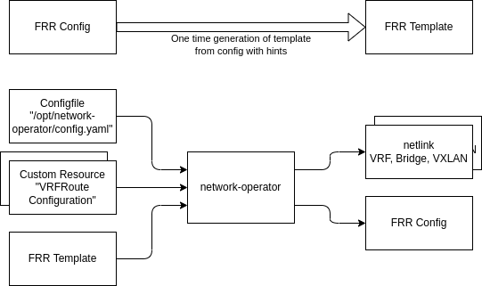
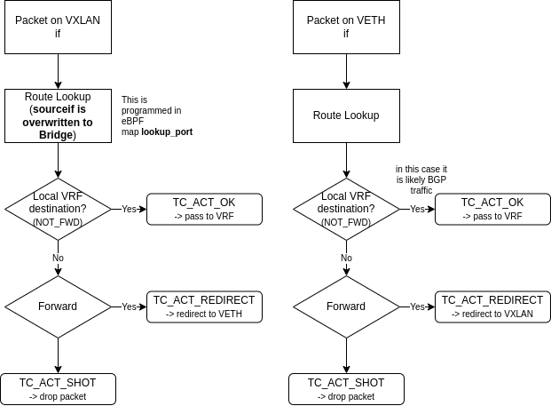

# network-operator

This operator / controller can configure netlink interfaces (VRFs, Bridges, VXLANs), attach some simple **eBPF** tc filters and template FRR configuration.

It is provided as a reference and not as a project that can be deployed as-is.

## Overview


## License

The project is licensed as Apache License Version 2.0 **except** `bpf/` which is licensed as GPLv2. (see LICENSE file at `bpf/LICENSE`).

## Configuration



After a change to the FRR config is detected a systemd reload for unit frr.service is issued via the dbus socket.

The reconcile process is runs at start time and everytime a change on the cluster is detected. However there is a debounce mechanism in place which only applies changes every 30s. From the first change "request" there is a gap of 30s until the execution of all changes that happened in that gap.

This tool is configured from multiple places:

### Configfile
The configfile shall be located at `/opt/network-operator/config.yaml` and contains the mapping from VRF name to **VNI**, interfaces the operator should attach its **BPF** code to and VRFs for which it should only configure **route-maps** and **prefix-lists**.

```yaml
vnimap: # VRF name to VNI mapping for the site
  vrf1: 100
  vrf2: 101
  vrf3: 102
skipVRFConfig: # Only configure route-maps / prefix-lists for VRFs from the provisioning process
- mgmt_vrf
bpfInterfaces: # Attach eBPF program to the interfaces from the provisioning process
- "br.mgmt_vrf"
- "mgmt_vrf_def"
- "vx.200"
```

### CustomResource VRFRouteConfiguration
The peerings and route leaking are configured from this custom resource. It contains a VRF to peer to and the routes that should be imported & exported.

There can be multiple CustomResources per VRF but it needs to be ensured that sequence numbers of them are not conflicting. In general each CustomResource is templated as one route-map entry for each direction and one prefix-list for each direction.

### FRR Template
For the network-operator to work some config hints need to be placed in the FRR configuration the node boots with. These hints should be comments and mark the place where we template our configuration. The following hints need to be placed:

| **Hint**                      | **Position**                                                    |
|-------------------------------|-----------------------------------------------------------------|
| `#++{{.VRFs}}`        | Usually at the beginning, after the configuration of other VRFs |
| `#++{{.Neighbors}}`   | At the router-bgp config for the default VRF                    |
| `#++{{.NeighborsV4}}` | At the router-bgp-af-ipv4-uni config for the default VRF        |
| `#++{{.BGP}}`         | After all router-bgp for every VRF are configured               |
| `#++{{.PrefixLists}}` | Can be placed anywhere, somewhere at the end                    |
| `#++{{.RouteMaps}}`   | Can be placed anywhere, somewhere at the end                    |

Also some special config should be in place:

1. A route-map for the standard management peering (to be able to dynamically configure additional exports at runtime), e.g. for mgmt_vrf:
    ```
    route-map rm_import_cluster_to_oam permit 20
        call rm_mgmt_vrf_export
    exit
    route-map rm_mgmt_vrf_export deny 65535
    exit
    ```
    Due to internal parsing of FRR one route-map entry should already be there (default deny). Also mgmt_vrf needs to be part of the list `skipVRFConfig` in the configuration file.
2. The default VRF `router-bgp` config must be marked as `router bgp <ASN> vrf default`. Otherwise a reload will delete it and replace it completely. This will break and crash FRR in the process.

## eBPF

The current design has evolved from a simple idea but there were some issues with the first iterations. This ultimately required to use eBPF in the **tc filter** chain.

1. We **can not** do route-leaking. There are some issues in the Linux Kernel that prevent us from doing this. The biggest issue was the issue for the Kernel to match a packet to an already established TCP connection.

2. VRFs with peer-veth (Virtual Ethernet) links work but have unforeseen consequences on netfilter/conntrack. With the current design of the kube-proxy and calico iptables rules packets are processed 2-3 times. This leads to conflichts in the conntrack tables.

3. There is a possibility to insert NOTRACK rules for the interfaces but we still need to process the whole stack when we actually do not need to do this.

4. XDP works on Intel cards (basically every card that does not do VXLAN / RX checksum offloading) but not on Mellanox. Because we are already working at the sk_buff level in the Kernel (after VXLAN decap) and we most probably process the packet in the local Linux Kernel anyway (with a need for that sk_buff) we would have needed to use **xdgeneric** anyway.

5. Our final decision was to use **eBPF** attached to **tc filter**. This simple **eBPF** program (from `pkg/bpf/router.c`) just routes packets from one interface to the other.

The following eBPF program is attached to all VXLAN, Bridge and VETH sides inside a VRF for VRFs. This is not applied to the cluster traffic VXLAN/Bridge.

An internal loop is tracking these interfaces and reapplies the eBPF code when needed.



